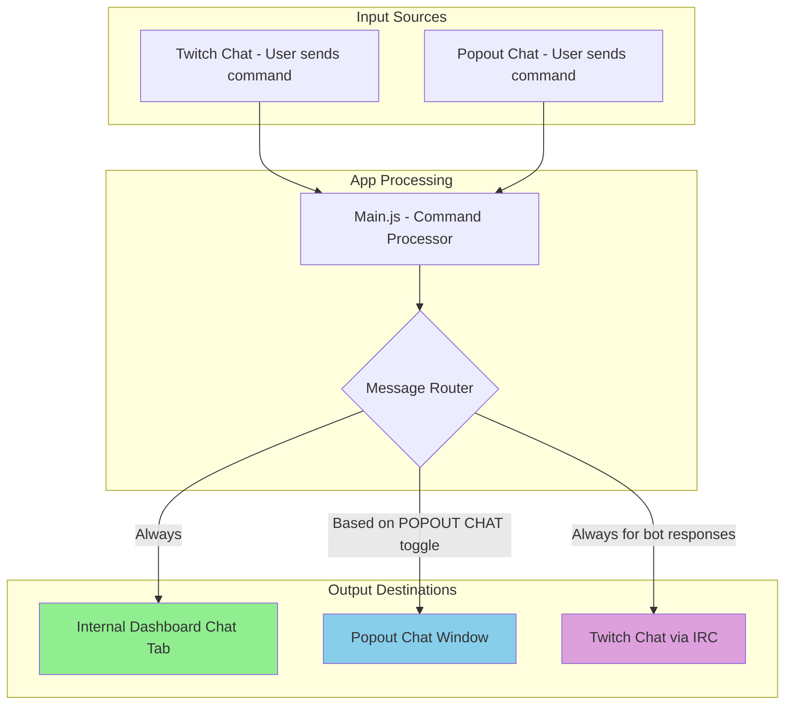

# Command System Implementation Plan

## Overview

This document outlines the implementation plan for the unified command system in the Campfire Widget, including message routing, toggle behaviors, and UI improvements.

---

## Architecture: Three Chat Types



### Chat Type Definitions

| Chat Type | Purpose | Filtering | Control |
|-----------|---------|-----------|---------|
| **Internal Dashboard Chat Tab** | Reference/debugging - shows ALL activity | None - shows everything | Cannot be silenced |
| **Popout Chat** | Curated viewer experience overlay | Respects SILENT and POPOUT CHAT toggles | Full app control |
| **Twitch Chat** | Public chat interface | SILENT requires mod privileges | Limited control via IRC |

---

## Toggle Definitions

### 1. SILENT Toggle

**Purpose**: Hide the user's command message from chat displays while still executing the command.

| State | Popout Chat | Twitch Chat | Internal Dashboard |
|-------|-------------|-------------|-------------------|
| **ON** | Command message hidden | Command message hidden (requires mod) | Shows everything |
| **OFF** | Command message shown | Command message shown | Shows everything |

**Implementation Notes**:
- Popout Chat: Fully implementable - app controls display
- Twitch Chat: Requires bot to be moderator + use `/delete <message-id>` command
- Internal Dashboard: Always shows all messages regardless of setting

### 2. POPOUT CHAT Toggle (renamed from All Chats)

**Purpose**: Control whether bot responses appear in the Popout Chat window.

| State | Bot Response Destinations |
|-------|--------------------------|
| **ON** | Twitch Chat + Popout Chat + Internal Dashboard |
| **OFF** | Twitch Chat + Internal Dashboard (NOT Popout) |

**Use Case**: Commands like `!howtoplay` with lengthy instructions can be toggled OFF to keep Popout Chat clean while still responding in Twitch.

### 3. Allow Non-Campers Checkbox

**Purpose**: Allow users who haven't joined the campfire to trigger commands.

| State | Behavior |
|-------|----------|
| **Checked** | Non-campers can use command. Action may fail (no sprite) but bot response still shows if message exists |
| **Unchecked** | Only campers (joined users) can use the command |

---

## Command Categories

### Bot Commands Sub-Tab
Standard commands with chat responses:
- `!join` - Join the campfire
- `!leave` - Leave the campfire
- `!afk` - Go AFK
- `!back` - Return from AFK
- `!help` - Show help message
- `!howtoplay` - Show instructions
- `!roam` - Toggle roaming
- `!spin` - Spin animation
- `!dance` - Dance animation
- `!sparkle` - Sparkle animation
- Custom commands created by streamer

### Movement/Appearance Sub-Tab
Commands that affect sprite state:

**Movement Commands**:
- `!cw` - Rotate sprite clockwise
- `!ccw` - Rotate sprite counter-clockwise

**Appearance Commands**:
- `!sprite` / `!changesprite` - Change sprite image
- `!color` / `!changecolor` - Change sprite color
- `!next` - Next sprite in list
- `!back` - Previous sprite in list
- `!random` - Random appearance

---

## Popout Chat Formatting

### Standard Commands
```
BotName: Response message here
```

### State/Animation/Movement/Appearance Commands
When displayed in Popout Chat, these use special formatting:
- No sender username prefix
- Italicized text
- Narrative style

**Examples**:
```
*johnjohnjohn joins the campfire!*
*johnjohnjohn went AFK*
*johnjohnjohn dances!*
*johnjohnjohn changed their sprite!*
```

**Command Categories for Italic Formatting**:
- STATE: join, leave, afk, back
- ANIMATIONS: spin, dance, sparkle
- MOVEMENT: cw, ccw
- APPEARANCE: sprite, color, next, back, random

---

## Implementation Tasks

### Phase 1: UI Updates

#### Task 1.1: Rename All Chats to Pop Out Chat
**Files**: `desktop-app/server/dashboard.html`
- Update label text from "All Chats" to "Pop Out Chat"
- Update tooltip to explain the toggle
- Update any variable names for clarity

#### Task 1.2: Add Response Message Fields to Movement/Appearance Commands
**Files**: `desktop-app/server/dashboard.html`, `desktop-app/main.js`
- Add message input field to each Movement/Appearance command
- Default to empty (no response)
- Allow streamer to customize responses

### Phase 2: Message Routing Architecture

#### Task 2.1: Decouple Popout Chat from Twitch Mirror
**Files**: `desktop-app/server/chat-popout.html`, `desktop-app/main.js`

Current flow:
```
Twitch IRC → App → Twitch IRC (response) → Popout mirrors Twitch
```

New flow:
```
Command Source → App → Message Router → Individual destinations
```

**Changes needed**:
1. Popout Chat should receive messages via IPC/WebSocket from app
2. App decides what to send to Popout based on toggle settings
3. Remove Twitch mirroring from Popout Chat

#### Task 2.2: Implement Message Router
**Files**: `desktop-app/main.js`

```javascript
function routeBotResponse(commandId, message, username, commandCategory) {
    const settings = botMessagesCache[commandId];
    
    // Always send to Internal Dashboard Chat
    sendToInternalChat({
        type: 'bot-response',
        message: message,
        username: username,
        commandId: commandId
    });
    
    // Always send to Twitch Chat
    sendToTwitchChat(message);
    
    // Send to Popout Chat only if toggle is ON
    if (settings.respondAllChats) { // renamed to respondPopoutChat
        const formattedMessage = formatForPopout(message, username, commandCategory);
        sendToPopoutChat(formattedMessage);
    }
}
```

### Phase 3: SILENT Implementation

#### Task 3.1: SILENT for Popout Chat
**Files**: `desktop-app/server/chat-popout.html`, `desktop-app/main.js`

When SILENT is ON for a command:
- Do NOT display the user's command message in Popout Chat
- Still execute the command
- Still show bot response (if POPOUT CHAT toggle is ON)

#### Task 3.2: SILENT for Twitch Chat (Future Implementation)
**Files**: `desktop-app/main.js`

**Requirements**:
- Bot account must be a moderator in the channel
- Capture message ID from incoming IRC message
- Send `/delete <message-id>` via PRIVMSG after processing

**IRC Message Format**:
```
@badge-info=;badges=;client-nonce=xxx;color=#FF0000;display-name=User;emotes=;
first-msg=0;flags=;id=MESSAGE-ID-HERE;mod=0;...
```

**Delete Command**:
```
PRIVMSG #channel :/delete MESSAGE-ID-HERE
```

**Note**: This will be documented for future implementation. For now, SILENT only affects Popout Chat.

### Phase 4: Italic Formatting for Special Commands

#### Task 4.1: Define Command Categories
**Files**: `desktop-app/main.js`

```javascript
const ITALIC_COMMAND_CATEGORIES = {
    STATE: ['join', 'leave', 'afk', 'back'],
    ANIMATIONS: ['spin', 'dance', 'sparkle'],
    MOVEMENT: ['cw', 'ccw'],
    APPEARANCE: ['sprite', 'changesprite', 'color', 'changecolor', 'next', 'back', 'random']
};

function isItalicCommand(commandId) {
    return Object.values(ITALIC_COMMAND_CATEGORIES)
        .flat()
        .includes(commandId);
}
```

#### Task 4.2: Format Messages for Popout Chat
**Files**: `desktop-app/server/chat-popout.html`

```javascript
function formatPopoutMessage(message, username, commandId) {
    if (isItalicCommand(commandId)) {
        // Narrative style, no bot name prefix
        return `<em>${message}</em>`;
    } else {
        // Standard format with bot name
        return `<strong>${botName}:</strong> ${message}`;
    }
}
```

### Phase 5: Internal Dashboard Chat

#### Task 5.1: Ensure All Messages Display
**Files**: `desktop-app/server/dashboard.html`

The Internal Dashboard Chat Tab must show:
- ALL user messages from Twitch
- ALL user messages from Popout Chat
- ALL bot responses (for enabled commands)
- Regardless of SILENT or POPOUT CHAT settings

This serves as the "source of truth" for debugging and monitoring.

### Phase 6: Grey Non-Campers Toggle

#### Task 6.1: Add Toggle to Popout Chat Window
**Files**: `desktop-app/server/chat-popout.html`

Add a toggle in the Popout Chat header that greys out messages from non-campers.

| Toggle State | Camper Messages | Non-Camper Messages |
|--------------|-----------------|---------------------|
| **ON** | Full color, normal styling | Greyed out, dimmed |
| **OFF** | Normal styling | Normal styling |

**Implementation**:
```javascript
function renderChatMessage(username, message) {
    const isCamper = checkIfUserIsCamper(username);
    const greyNonCampers = getToggleSetting('greyNonCampers');
    
    const messageClass = (!isCamper && greyNonCampers) ? 'non-camper' : '';
    
    return `<div class="chat-message ${messageClass}">
        <span class="username">${username}</span>: ${message}
    </div>`;
}
```

**CSS**:
```css
.chat-message.non-camper {
    opacity: 0.5;
    color: #888;
}
```

**Camper Detection**: A user is a "camper" if they have an active sprite (joined, AFK, or roaming state).

---

## File Changes Summary

| File | Changes |
|------|---------|
| `desktop-app/server/dashboard.html` | Rename toggle, add response fields, update tooltips |
| `desktop-app/main.js` | Message router, command categories, SILENT logic |
| `desktop-app/server/chat-popout.html` | Receive messages from app (not Twitch mirror), italic formatting |
| `desktop-app/preload.js` | IPC channels for message routing |

---

## Testing Checklist

- [ ] All Chats renamed to Pop Out Chat in UI
- [ ] SILENT toggle hides user commands in Popout Chat
- [ ] POPOUT CHAT toggle controls bot response destination
- [ ] Allow non-campers works for all commands
- [ ] Movement/Appearance commands have response message fields
- [ ] Italic formatting for State/Animation/Movement/Appearance in Popout
- [ ] Internal Dashboard Chat shows ALL messages
- [ ] Both sub-tabs (Bot Commands, Movement/Appearance) have working toggles
- [ ] New custom commands get all toggle options
- [ ] Grey Non-Campers toggle works in Popout Chat
- [ ] Messages from Twitch appear in Popout Chat
- [ ] Messages from Popout Chat are sent to Twitch

---

## Future Enhancements

### Twitch SILENT Implementation

To implement SILENT for Twitch Chat:

1. **Ensure bot is moderator** in the channel
2. **Capture message ID** from IRC tags when command is received
3. **Send delete command** after processing:
   ```javascript
   // After processing the command
   if (settings.silent && messageId) {
       twitchClient.say(channel, `/delete ${messageId}`);
   }
   ```

4. **Handle errors** gracefully if deletion fails (bot not mod, message already deleted, etc.)

### Additional Ideas
- Command cooldowns per user
- Command usage statistics
- Scheduled/timed commands
- Command aliases

---

## Approval

Please review this implementation plan and let me know if you'd like any changes before we proceed to implementation.

**Questions**:
1. Does this plan accurately capture your requirements?
2. Any adjustments to the italic formatting categories?
3. Ready to proceed with implementation?
