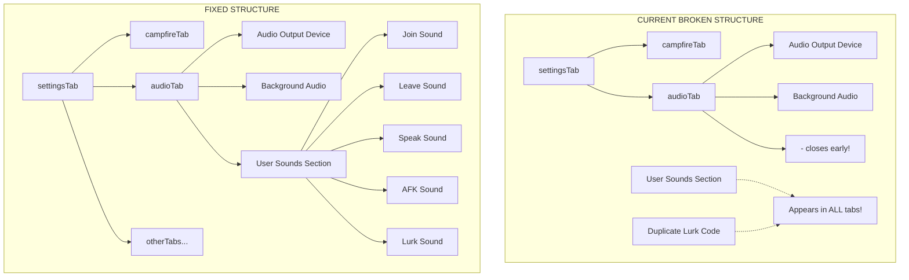

# Dashboard Cleanup & Visual Improvement Plan

## Executive Summary

This plan outlines a comprehensive cleanup of the Campfire Widget dashboard, addressing HTML structural issues, CSS consolidation, and visual improvements while preserving all settings and functionality.

---

## 🔴 CRITICAL BUG IDENTIFIED: Audio Settings Leaking to All Tabs

### Root Cause

In [`desktop-app/server/dashboard.html`](desktop-app/server/dashboard.html:1232-1410), the audio tab content structure is broken:

```
Line 1233: <div id="audioTab" class="settings-section">
    [Audio Output Device Section - INSIDE audioTab ✓]
    [Background Audio Section - INSIDE audioTab ✓]
Line 1314: </div>  ← Closes audio-section
Line 1315: </div>  ← Closes audioTab ❌
    
Line 1317: <!-- User Sounds Section -->
    <div class="audio-section">  ← OUTSIDE audioTab! ❌
    [User Sounds Grid - LEAKING to all tabs!]

Line 1391: <div class="user-sound-item">  ← ALSO OUTSIDE audioTab! ❌
    [Duplicate Lurk sound code]
```

### The Problem
- The `audioTab` div closes at line 1315
- The "User Sounds Section" (lines 1317-1390) is **outside** the audioTab div
- The "User Sounds" code at lines 1391-1405 is also **outside** the audioTab div
- When tabs hide/show using CSS (`display: none`), only content **inside** the proper tab divs gets hidden
- Content outside the tab structure appears in ALL tabs

### The Fix Required
Move these sections **inside** the `audioTab` div:
- Lines 1317-1390: "User Sounds Section" (`<div class="audio-section">`)
- Lines 1391-1405: Duplicate lurk sound item code

---

## 📋 Complete Task List

### Phase 1: Fix Critical Tab Structure Bug

- [ ] **TASK 1.1**: Move "User Sounds Section" (lines 1317-1390) inside `<div id="audioTab">`
- [ ] **TASK 1.2**: Remove duplicate lurk sound code (lines 1391-1405) that's outside audioTab
- [ ] **TASK 1.3**: Verify all tab content is properly contained within their respective tab divs
- [ ] **TASK 1.4**: Test that audio settings only appear in Audio tab

### Phase 2: HTML Structure Improvements

- [ ] **TASK 2.1**: Audit all inline `style` attributes (150+ instances) and extract to CSS classes
- [ ] **TASK 2.2**: Consolidate duplicated HTML structures (e.g., user sound items)
- [ ] **TASK 2.3**: Move inline `<style>` blocks from dashboard.html to CSS files
- [ ] **TASK 2.4**: Add semantic HTML structure (sections, headers, article tags)
- [ ] **TASK 2.5**: Organize 8590-line dashboard.html into logical sections with comments

### Phase 3: CSS Consolidation & Modernization

- [ ] **TASK 3.1**: Consolidate 4 dashboard CSS files into logical structure:
  - [`dashboard-base.css`](desktop-app/server/styles/dashboard-base.css) - layout, containers, scrollbars
  - [`dashboard-forms.css`](desktop-app/server/styles/dashboard-forms.css) - form elements, inputs
  - [`dashboard-tabs.css`](desktop-app/server/styles/dashboard-tabs.css) - navigation, tabs
  - [`dashboard-modes.css`](desktop-app/server/styles/dashboard-modes.css) - modals, popups
- [ ] **TASK 3.2**: Replace hardcoded colors with CSS variables from [`shared-styles.css`](desktop-app/server/styles/shared-styles.css)
- [ ] **TASK 3.3**: Remove duplicate/overlapping CSS rules
- [ ] **TASK 3.4**: Add CSS custom properties for consistent theming
- [ ] **TASK 3.5**: Add focus states for accessibility
- [ ] **TASK 3.6**: Improve button hover/active states

### Phase 4: Visual Improvements

- [ ] **TASK 4.1**: Standardize spacing (margins, padding) across all sections
- [ ] **TASK 4.2**: Improve visual hierarchy with consistent font sizes and weights
- [ ] **TASK 4.3**: Add subtle transitions/animations for interactive elements
- [ ] **TASK 4.4**: Improve form field labels and hint text styling
- [ ] **TASK 4.5**: Add consistent border-radius values (currently varies 4px-8px)
- [ ] **TASK 4.6**: Improve scrollbar styling consistency

### Phase 5: Organization & Documentation

- [ ] **TASK 5.1**: Add comments to HTML sections explaining their purpose
- [ ] **TASK 5.2**: Add comments to CSS files explaining rule groupings
- [ ] **TASK 5.3**: Create CSS variable reference section in shared-styles.css
- [ ] **TASK 5.4**: Document all settings locations (mapping old → new)

---

## 📁 Files to Modify

| File | Changes |
|------|---------|
| `desktop-app/server/dashboard.html` | Fix tab structure, extract inline styles, reorganize |
| `desktop-app/server/styles/dashboard-base.css` | Add extracted layout classes |
| `desktop-app/server/styles/dashboard-forms.css` | Add extracted form classes |
| `desktop-app/server/styles/dashboard-tabs.css` | Add extracted tab classes |
| `desktop-app/server/styles/dashboard-modes.css` | Add extracted modal classes |
| `desktop-app/server/styles/shared-styles.css` | Add missing CSS variables |

---

## 🔧 Settings Location Mapping (To Be Documented)

All settings will remain in their current locations. Any settings that need to be moved will be documented here:

| Setting | Current Location | New Location | Status |
|---------|------------------|--------------|--------|
| Campfire Graphic | campfireTab | No change | ✓ |
| Glow Settings | glowTab | No change | ✓ |
| View/Size Settings | sizeTab | No change | ✓ |
| Sprite Settings | spritesTab | No change | ✓ |
| Twitch Connection | twitchTab | No change | ✓ |
| Chat Settings | chatTab | No change | ✓ |
| Join Rules | joinTab | No change | ✓ |
| Members List | membersTab | No change | ✓ |
| Commands | commandsTab | No change | ✓ |
| OBS Code | codeTab | No change | ✓ |
| **Audio Settings** | **LEAKING - needs fix** | **Stay in audioTab** | **🔧 FIX NEEDED** |
| App Settings | settingsModal | No change | ✓ |

---

## 🧪 Testing Checklist

- [ ] All 11 tabs load without errors
- [ ] Audio settings ONLY appear in Audio tab
- [ ] No duplicate content in any tab
- [ ] All settings persist to localStorage
- [ ] Settings sync to main process via IPC
- [ ] Preview updates when settings change
- [ ] No JavaScript errors in console
- [ ] Buttons respond to hover/focus states
- [ ] Forms validate input correctly
- [ ] Audio playback works for all channels
- [ ] Sprite loading completes successfully
- [ ] Twitch connection status updates correctly
- [ ] Responsive design works on smaller screens

---

## 📐 Mermaid Diagram: Current vs Fixed Tab Structure



---

## ⚠️ Before You Approve

1. **This is a VISUAL cleanup only** - no functionality changes
2. **All settings will remain** in their current locations
3. **The audio tab bug fix** is the highest priority (content leaking to all tabs)
4. **I'll document every change** so you can verify nothing is lost
5. **We should test after each phase** to catch issues early

Do you want me to proceed with this plan? Should I start with the critical audio tab bug fix first, or would you like any modifications to this plan?
