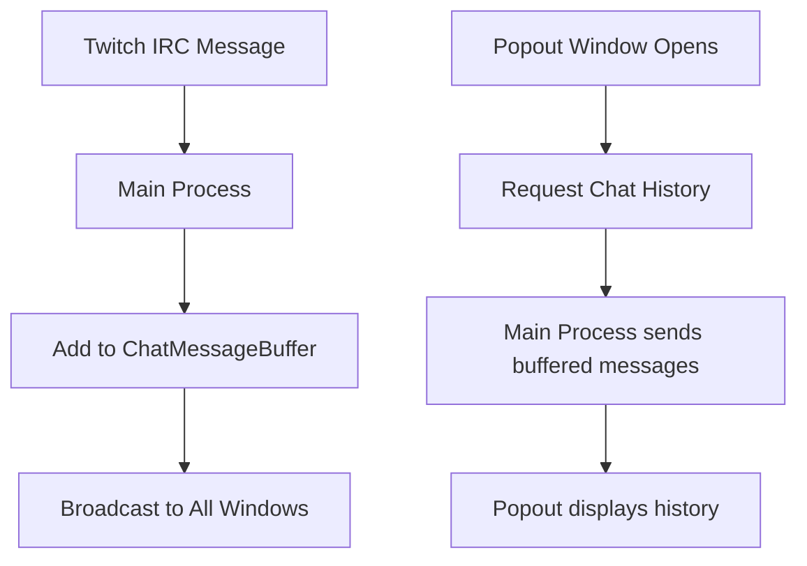
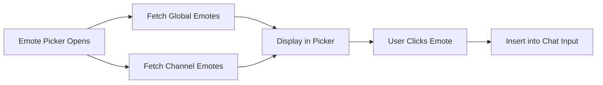
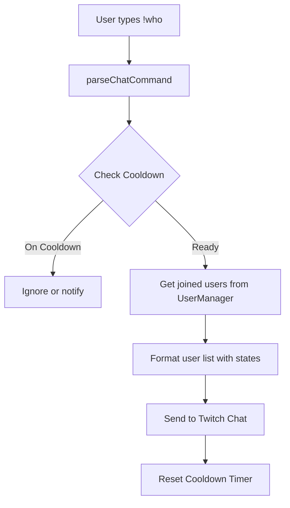
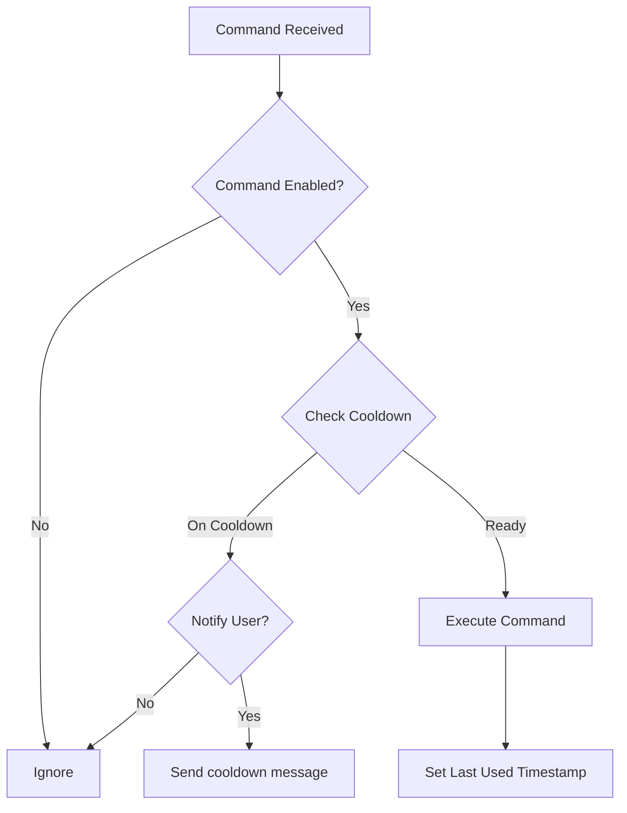

# Popout Chat Improvements & !who Command Plan

## Implementation Status: ✅ COMPLETE

All features have been implemented and are ready for testing.

## Overview

This document outlines the implementation plan for three feature requests related to the Popout Chat and a new `!who` command, plus an analysis of adding cooldown timers to the command system.

## User Decisions (Confirmed)

| Decision | Choice |
|----------|--------|
| Chat History Buffer Size | 200 messages |
| !who Format | Each camper on separate line with status icon |
| !who Command Type | Default/undeletable, but message text editable |
| Cooldown Default | 3 seconds for all commands (adjustable) |
| !who Cooldown Default | 30 seconds |
| Cooldown UI | Toggle + seconds input for each command |
| Emote Scope | `user:read:emotes` already added to Streamer account |

## Implementation Summary

| Feature | Status | Files Modified |
|---------|--------|----------------|
| Chat Message Persistence | ✅ Complete | `main.js`, `preload.js`, `chat-popout.html` |
| Cooldown System | ✅ Complete | `main.js` (botMessagesCache, parseChatCommand) |
| !who Command | ✅ Complete | `main.js` (handleWhoCommand, actionFunctions) |
| Emoji Picker | ✅ Complete | `chat-popout.html` (UI + JS) |
| Twitch Emote Picker | ✅ Complete | `main.js`, `preload.js`, `chat-popout.html` |

---

## Feature 1: Chat Message Persistence in Popout Chat

### Current Behavior
- When the popout chat window is opened, it starts empty
- Messages are only received via IPC from the main process after the window opens
- Closing and reopening the window loses all previous messages
- The [`chat-popout.html`](desktop-app/server/chat-popout.html:486) stores messages in a local `messages` array but this is lost on window close

### Problem Analysis
The main process does **not** currently buffer/store chat messages. Messages flow directly from Twitch IRC → main process → broadcast to windows. There is no chat history maintained.

### Proposed Solution: Chat Message Buffer in Main Process

**Feasibility: ✅ FULLY POSSIBLE**



### Implementation Steps

1. **Create ChatMessageBuffer in main.js**
   - Add a circular buffer to store recent messages (e.g., last 200 messages)
   - Store full message data including username, color, emotes, timestamp, isCamper flag
   - Buffer should be in-memory only (no persistence to disk needed)

2. **Add IPC handler for chat history**
   - New handler: `get-chat-history`
   - Returns the buffered messages array

3. **Update chat-popout.html**
   - On window load, request chat history via `electronAPI.getChatHistory()`
   - Populate the chat container with historical messages
   - Continue receiving new messages via existing `onChatMessage` listener

4. **Update preload.js**
   - Add `getChatHistory: () => ipcRenderer.invoke('get-chat-history')`

### Code Changes Required

| File | Change |
|------|--------|
| [`desktop-app/main.js`](desktop-app/main.js) | Add `chatMessageBuffer` array, modify `broadcastToWidget` to buffer messages, add `get-chat-history` IPC handler |
| [`desktop-app/preload.js`](desktop-app/preload.js) | Add `getChatHistory` API |
| [`desktop-app/server/chat-popout.html`](desktop-app/server/chat-popout.html) | Request and display history on load |

### Considerations
- Buffer size should be configurable (default: 200 messages)
- Messages older than a certain time could be excluded (e.g., 1 hour)
- This follows the **Single Source of Truth** principle - main process owns the buffer

---

## Feature 2: Emoji and Emote Picker for Popout Chat

### Current Behavior
- Users can type Twitch emote names manually (e.g., `Kappa`)
- Emotes are rendered when messages are received (via Twitch CDN)
- No visual picker exists for emotes or emojis
- There is an emote button placeholder in the UI but no functionality

### Analysis

#### 2A: Emoji Picker

**Feasibility: ✅ FULLY POSSIBLE**

Standard Unicode emojis can be added without any Twitch API requirements.

**Options:**
1. **Native emoji picker** - Use a library like `emoji-mart` or `emoji-picker-element`
2. **Simple emoji grid** - Build a custom grid of common emojis

**Recommendation:** Use a lightweight emoji picker library or build a simple custom grid.

#### 2B: Twitch Emote Picker

**Feasibility: ⚠️ PARTIALLY POSSIBLE - Requires Additional API Calls**

Twitch emotes come from multiple sources:
1. **Global Twitch Emotes** - Available to all users
2. **Channel Emotes** - Subscriber emotes for the channel
3. **User Emotes** - Emotes the user has access to (subscriptions, Twitch Turbo, etc.)
4. **Third-party Emotes** - BTTV, FFZ, 7TV (separate APIs)

### Twitch API Requirements

**Current Scopes (already have):**
- `chat:read` - Read chat messages
- `chat:edit` - Send chat messages
- `channel:read:subscriptions` - Read subscriber info
- `moderator:read:chatters` - Read chatters list
- `user:read:chat` - Read user chat colors

**Additional Scopes Needed:**
- `user:read:emotes` - **NEW** - Required to get emotes the user can use

### Implementation Options

#### Option A: Global + Channel Emotes Only (No new scopes)



**API Endpoints:**
- Global emotes: `GET https://api.twitch.tv/helix/chat/emotes/global`
- Channel emotes: `GET https://api.twitch.tv/helix/chat/emotes?broadcaster_id={id}`

**Limitation:** User may see emotes they cannot use (subscriber-only emotes)

#### Option B: Full User Emotes (Requires new scope)

**Additional Scope:** `user:read:emotes`

**API Endpoint:**
- User emotes: `GET https://api.twitch.tv/helix/chat/emotes/user`

This returns all emotes the authenticated user can use.

### Recommended Implementation

**Phase 1: Emoji Picker (No API needed)**
1. Add emoji picker button next to chat input
2. Implement simple emoji grid with common emojis
3. Click to insert emoji at cursor position

**Phase 2: Twitch Emote Picker (Global + Channel)**
1. Fetch global emotes on app start (cache them)
2. Fetch channel emotes when connecting to channel
3. Display in tabbed picker (Global | Channel)
4. Show emote images with names on hover

**Phase 3 (Optional): User Emotes**
1. Add `user:read:emotes` scope to OAuth flow
2. Fetch user-specific emotes
3. Add "My Emotes" tab to picker

### Code Changes Required

| File | Change |
|------|--------|
| [`desktop-app/main.js`](desktop-app/main.js) | Add emote fetching functions, cache emotes, add IPC handlers |
| [`desktop-app/preload.js`](desktop-app/preload.js) | Add `getGlobalEmotes`, `getChannelEmotes`, `getUserEmotes` APIs |
| [`desktop-app/server/chat-popout.html`](desktop-app/server/chat-popout.html) | Add emoji/emote picker UI, handle emote insertion |

### Third-Party Emotes (BTTV, FFZ, 7TV)

**Feasibility: ✅ POSSIBLE but adds complexity**

These are separate APIs with their own endpoints:
- BTTV: `https://api.betterttv.net/3/cached/emotes/global`
- FFZ: `https://api.frankerfacez.com/v1/set/global`
- 7TV: `https://7tv.io/v3/emote-sets/global`

**Recommendation:** Consider as a future enhancement, not initial implementation.

---

## Feature 3: !who Command - List Users Around Campfire

### Current Behavior
- No command exists to list current campfire users
- [`UserManager`](desktop-app/src/main/state/UserManager.js) tracks all users with states
- User states: `IN_CHAT`, `JOINED`, `ACTIVE`, `SLEEPY`, `AFK`, `LURK`

### Proposed Solution

**Feasibility: ✅ FULLY POSSIBLE**

Create a new `!who` command that lists users around the campfire with their statuses.

### Implementation Design



### Message Format Options

**Option 1: Simple List**
```
🔥 Around the campfire: user1, user2 (💤), user3 (👁️), user4 (😴)
```

**Option 2: Grouped by Status**
```
🔥 Campfire (5): Active: user1, user2 | Sleepy: user3 | AFK: user4 | Lurking: user5
```

**Option 3: Compact with Counts**
```
🔥 5 campers: 2 active, 1 sleepy, 1 AFK, 1 lurking
```

### State Icons
- `ACTIVE` / `JOINED`: (no icon, or 🔥)
- `SLEEPY`: 😴 or 💤
- `AFK`: 💤 or ⏸️
- `LURK`: 👁️ or 🌙

### Command Configuration

The `!who` command should be a **special default command** with:
- Customizable trigger (default: `!who`)
- Customizable message template
- Customizable cooldown timer
- Enable/disable toggle
- Silent mode option (respond only in popout, not Twitch)

### Code Changes Required

| File | Change |
|------|--------|
| [`desktop-app/main.js`](desktop-app/main.js) | Add `handleWhoCommand` function, add to `botMessagesCache`, add cooldown tracking |
| [`desktop-app/src/main/state/UserManager.js`](desktop-app/src/main/state/UserManager.js) | Add `getFormattedUserList()` method |

---

## Feature 3+: Cooldown Timer for ALL Commands

### Current Architecture Analysis

The current command system in [`main.js`](desktop-app/main.js:1863) defines commands like:

```javascript
{ 
  id: 'spin', 
  name: 'Spin Command', 
  commands: ['!spin'], 
  message: '{username} spins!', 
  enabled: true, 
  category: 'ANIMATION', 
  silent: false, 
  respondAllChats: true, 
  action: 'handleSpinCommand' 
}
```

**Current Properties:**
- `id`, `name`, `commands`, `command`
- `message`, `enabled`, `category`
- `silent`, `respondAllChats`
- `action`, `allowNonCampers`

**Missing:** `cooldown` property

### Proposed Cooldown System

**Feasibility: ✅ STRAIGHTFORWARD IMPLEMENTATION**

This is NOT a huge overhaul. The command system is already well-structured.

### Implementation Design



### Cooldown Types

1. **Global Cooldown** - Applies to all users (e.g., `!who` can only be used once per 30 seconds by anyone)
2. **Per-User Cooldown** - Each user has their own cooldown (e.g., each user can `!spin` once per 10 seconds)

**Recommendation:** Implement **per-user cooldowns** as the default, with an option for global cooldowns on specific commands like `!who`.

### Data Structure

```javascript
// Add to command definition
{ 
  id: 'spin', 
  // ... existing properties ...
  cooldown: 10000,           // Cooldown in milliseconds (0 = no cooldown)
  cooldownType: 'per-user',  // 'per-user' or 'global'
  cooldownMessage: ''        // Optional message when on cooldown
}

// Cooldown tracking (in memory)
const commandCooldowns = {
  // For per-user cooldowns
  'spin': {
    'user123': 1706345678000,  // Last used timestamp
    'user456': 1706345679000
  },
  // For global cooldowns
  'who': {
    '_global': 1706345680000
  }
};
```

### Implementation Steps

1. **Add cooldown properties to command schema**
   - `cooldown`: number (milliseconds, 0 = disabled)
   - `cooldownType`: 'per-user' | 'global'
   - `cooldownMessage`: string (optional)

2. **Create cooldown tracking system**
   - In-memory Map for tracking last-used timestamps
   - Function to check if command is on cooldown
   - Function to update cooldown timestamp

3. **Integrate into parseChatCommand**
   - Check cooldown before executing command
   - Update cooldown after successful execution

4. **Update Dashboard UI**
   - Add cooldown input field to command customization
   - Add cooldown type dropdown (per-user/global)

### Code Changes Required

| File | Change |
|------|--------|
| [`desktop-app/main.js`](desktop-app/main.js) | Add cooldown tracking Map, add `checkCooldown()` and `updateCooldown()` functions, modify `parseChatCommand()` |
| [`desktop-app/server/dashboard.html`](desktop-app/server/dashboard.html) | Add cooldown configuration UI in Bot Messages section |
| [`desktop-app/src/main/constants.js`](desktop-app/src/main/constants.js) | Add default cooldown values |

### Migration Considerations

- Existing commands should default to `cooldown: 0` (no cooldown)
- The `!who` command should have a default global cooldown (e.g., 30 seconds)
- Cooldown settings should be saved with bot messages configuration

---

## Summary & Recommendations

| Feature | Feasibility | Complexity | New Scopes Needed |
|---------|-------------|------------|-------------------|
| Chat Message Persistence | ✅ Fully Possible | Low | None |
| Emoji Picker | ✅ Fully Possible | Low | None |
| Twitch Emote Picker (Basic) | ✅ Fully Possible | Medium | None |
| Twitch Emote Picker (Full) | ✅ Fully Possible | Medium | `user:read:emotes` |
| Third-Party Emotes (BTTV/FFZ/7TV) | ✅ Possible | Medium-High | None (external APIs) |
| !who Command | ✅ Fully Possible | Low-Medium | None |
| Cooldown System | ✅ Straightforward | Medium | None |

### Recommended Implementation Order

1. **Chat Message Persistence** - Quick win, improves UX significantly
2. **Emoji Picker** - Simple addition, no API needed
3. **!who Command** - New feature, requires cooldown system
4. **Cooldown System** - Enables !who and improves all commands
5. **Twitch Emote Picker (Basic)** - Uses existing scopes
6. **Twitch Emote Picker (Full)** - Requires scope addition
7. **Third-Party Emotes** - Future enhancement

### Architecture Alignment

All proposed changes follow the principles in [`DEVELOPER_GUIDE.md`](DEVELOPER_GUIDE.md):

- ✅ **Single Source of Truth** - Chat buffer in main process, cooldown tracking centralized
- ✅ **No Placeholder Logic** - All features fully implemented or not at all
- ✅ **Fail Loudly** - Proper error handling for API calls
- ✅ **Explicit Over Implicit** - Clear cooldown configuration, explicit state tracking

---

## User Decisions (Confirmed)

| Decision | Choice |
|----------|--------|
| Chat History Buffer Size | 200 messages |
| !who Format | Each camper on separate line with status icon |
| !who Command Type | Default/undeletable, but message text editable |
| Cooldown Default | 3 seconds for all commands (toggle + input, disabled by default) |
| !who Cooldown Default | 30 seconds global |
| Cooldown UI | Toggle + seconds input for each command |
| Emote Scope | `user:read:emotes` already added to Streamer account |

---

## Required OAuth Scopes (Final)

### Streamer Account (Main Account)
| Scope | Purpose |
|-------|---------|
| `chat:read` | Read chat messages |
| `chat:edit` | Send chat messages |
| `channel:read:subscriptions` | Read subscriber information |
| `moderator:read:chatters` | Read list of chatters in channel |
| `user:read:chat` | Read user chat colors |
| `user:read:emotes` | **NEW** - Get emotes the user can use for emote picker |

### Bot Account (if separate)
| Scope | Purpose |
|-------|---------|
| `chat:read` | Read chat messages |
| `chat:edit` | Send chat messages |

**Note:** The bot account does NOT need `user:read:emotes` since the emote picker uses the streamer's emotes.

---

## Implementation Todo List

### Phase 1: Chat Message Persistence
- [ ] Add `chatMessageBuffer` array in main.js (max 200 messages)
- [ ] Modify `broadcastToWidget` to add messages to buffer
- [ ] Add `get-chat-history` IPC handler
- [ ] Add `getChatHistory` to preload.js
- [ ] Update chat-popout.html to request history on load

### Phase 2: Cooldown System
- [ ] Add cooldown properties to command schema (`cooldown`, `cooldownEnabled`, `cooldownType`)
- [ ] Create `commandCooldowns` Map for tracking
- [ ] Add `checkCooldown()` function
- [ ] Add `updateCooldown()` function
- [ ] Integrate cooldown check into `parseChatCommand()`
- [ ] Update dashboard UI with cooldown toggle and seconds input
- [ ] Set default cooldown to 3 seconds (disabled by default)

### Phase 3: !who Command
- [ ] Add `handleWhoCommand` function
- [ ] Add `getFormattedUserList()` to UserManager
- [ ] Add !who to `botMessagesCache` as default/undeletable command
- [ ] Format: each user on separate line with status icon
- [ ] Default cooldown: 30 seconds global
- [ ] Make message template editable but command undeletable

### Phase 4: Emoji Picker
- [ ] Add emoji picker button to chat-popout.html
- [ ] Create emoji grid UI (common emojis)
- [ ] Handle emoji insertion at cursor position

### Phase 5: Twitch Emote Picker
- [ ] Add emote fetching functions to main.js
- [ ] Fetch global emotes on app start
- [ ] Fetch channel emotes on channel connect
- [ ] Fetch user emotes (using `user:read:emotes` scope)
- [ ] Add IPC handlers for emote data
- [ ] Create tabbed emote picker UI (Global | Channel | My Emotes)
- [ ] Handle emote insertion

---

*Document Version: 1.1*
*Created: 2026-01-27*
*Updated: 2026-01-27 - Added user decisions and final scope list*
