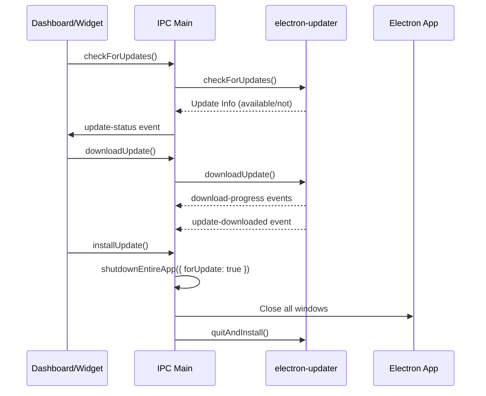
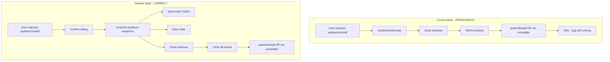

# UPDATER and UNINSTALLER Analysis

**Author:** Architect Mode Analysis  
**Date:** 2026-02-02  
**Status:** Complete Analysis (Updated with Additional Findings)

---

## Executive Summary

This document provides a comprehensive analysis of the UPDATER (auto-updater) and UNINSTALLER systems in the Campfire Widget desktop application. Both systems have significant issues that prevent them from working correctly:

1. **UPDATER:** The auto-updater fails because windows are not properly closed before `quitAndInstall()` is called, causing the installer to detect the app as "still running." Additionally, there are 12+ other issues found.

2. **UNINSTALLER:** There is **no custom uninstaller implementation** in the codebase. The app relies entirely on the NSIS uninstaller generated by electron-builder, but there is no UI/menu option to trigger it, and no graceful shutdown sequence before uninstallation.

---

## Table of Contents

1. [UPDATER System Analysis](#updater-system-analysis)
2. [UNINSTALLER System Analysis](#uninstaller-system-analysis)
3. [Root Cause Analysis](#root-cause-analysis)
4. [Recommended Solutions](#recommended-solutions)
5. [Implementation Plan](#implementation-plan)

---

## UPDATER System Analysis

### Current Implementation

The auto-updater uses [`electron-updater`](https://www.electron-updater.com/) library (version ^6.7.3) and is implemented in [`desktop-app/main.js`](desktop-app/main.js).

#### Key Components:

| Component | Location | Purpose |
|-----------|----------|---------|
| `initializeAutoUpdater()` | main.js:~6890 | Initializes electron-updater with event handlers |
| IPC Handlers | main.js:~6817-6860 | `check-for-updates`, `download-update`, `install-update` |
| `shutdownEntireApp({ forUpdate: true })` | main.js:~258 | Graceful shutdown before update |
| Renderer IPC | preload.js:~116-122 | Exposes updater API to UI |

#### Auto-Updater Flow:



---

## UPDATER Issues Identified

### Critical Issues

#### Issue 1: Windows Not Properly Closed Before quitAndInstall()

**Symptom:** The installer thinks the program is still open and refuses to proceed.

**Root Cause:** The [`shutdownEntireApp()`](desktop-app/main.js:258) function attempts to close windows, but there are several problems:

1. **Race condition:** The 600ms delay (`await new Promise(r => setTimeout(r, 600))`) may not be enough time for all windows to fully close
2. **Window listeners not removed:** Some windows may have custom close handlers that prevent closure
3. **Renderer processes not fully terminated:** Electron windows may close visually but renderer processes may still be running

**Code Location:**
```javascript
// main.js ~line 275-294
async function shutdownEntireApp({ reason = 'shutdown', forUpdate = false } = {}) {
    // ...
    // Close all windows
    try {
        const wins = BrowserWindow.getAllWindows();
        wins.forEach(w => {
            try { w.removeAllListeners('close'); } catch (e) { /* ignore */ }
            try { w.close(); } catch (e) { /* ignore */ }
        });
    } catch (e) { /* ignore */ }

    // Allow a moment for sockets/windows to close
    await new Promise(r => setTimeout(r, 600));

    if (forUpdate) {
        try {
            autoUpdater.quitAndInstall(false, true);
            return;
        } catch (e) {
            console.error('[Main] quitAndInstall failed:', e);
        }
    }
}
```

#### Issue 2: Twitch Clients Not Properly Disconnected

**Symptom:** Network handles remain open, preventing clean shutdown.

**Root Cause:** The [`disconnectTwitchClients()`](desktop-app/main.js:241) function has nested try-catch blocks that may swallow errors, and the disconnection is asynchronous but not awaited before window closure.

**Code Location:**
```javascript
// main.js ~line 241-256
async function disconnectTwitchClients() {
    try {
        if (twitchClient) {
            try { await twitchClient.disconnect(); } catch (e) { /* ignore */ }
        }
    } catch (e) { /* ignore */ }
    // ...
}
```

#### Issue 3: No Verification of Window Closure

**Symptom:** The app assumes windows are closed after a timeout, but doesn't verify.

**Root Cause:** There is no check to confirm all windows are actually closed before calling `quitAndInstall()`.

---

### High Priority Issues

#### Issue 4: Repo Name Mismatch

**Symptom:** Update checks may fail due to incorrect repository name.

**Root Cause:** The GitHub repo configuration is inconsistent:

```javascript
// package.json ~line 77-79
"publish": [{
    "provider": "github",
    "owner": "jaredheafth",
    "repo": "Campfire_BETA"  // <-- Different!
}]

// main.js ~line 6825-6827
const feedConfig = {
    provider: 'github',
    owner: 'jaredheafth',
    repo: 'offlineclub_widget_Campfire',  // <-- Different!
    private: isPrivateRepo
}
```

**Impact:** If the repo names don't match, electron-updater won't find the correct release assets.

---

### Medium Priority Issues

#### Issue 5: Signature Verification Disabled on Windows

**Symptom:** No security verification of update binaries on Windows.

**Code Location:**
```javascript
// main.js ~line 6902-6904
if (process.platform === 'win32') {
    autoUpdater.verifySignature = false;
}
```

**Problem:** Disabling signature verification is a security risk. While this may be necessary for development/unsigned installers, it should be configurable, not hardcoded.

#### Issue 6: IPC Handlers Don't Return Error Objects

**Symptom:** UI cannot properly handle update errors.

**Code Location:**
```javascript
// main.js ~line 6818-6839
ipcMain.handle('check-for-updates', async () => {
    try {
        autoUpdater.setFeedURL(feedConfig);
        const result = await autoUpdater.checkForUpdates();
        return { success: true, updateInfo: result?.updateInfo };
    } catch (err) {
        // No error return - returns undefined!
    }
});
```

**Problem:** If an error occurs, the handler returns `undefined` instead of `{ success: false, error: ... }`, making it hard for the UI to handle errors properly.

#### Issue 7: Download/Install Handlers Don't Return Errors

Same issue as above for `download-update` and `install-update` handlers.

#### Issue 8: No Network Error Handling

**Symptom:** If GitHub is unreachable, users get no feedback.

**Problem:** The error handler simply logs to console without:
- Notifying the user
- Retrying with backoff
- Caching the last successful check time

#### Issue 9: Double quitAndInstall() Fallback

**Code Location:**
```javascript
// main.js ~line 6858-6860
shutdownEntireApp({ reason: 'install-update', forUpdate: true }).catch(() => {
    try { autoUpdater.quitAndInstall(false, true); } catch (e) { /* ignore */ }
    try { app.exit(0); } catch (e2) { /* ignore */ }
});
```

**Problem:** If `shutdownEntireApp()` fails, there's a fallback to call `quitAndInstall()` directly, but this could lead to race conditions where both try to run.

---

### Low Priority Issues

#### Issue 10: Background Update Checks Only on Non-Windows

**Code Location:**
```javascript
// main.js ~line 7313-7314
const shouldBackgroundCheckUpdates = app.isPackaged && process.platform !== 'win32';
```

**Problem:** Background update checks are explicitly disabled on Windows. Users won't get automatic update notifications on Windows unless they manually check.

#### Issue 11: No Update Channel Support

**Problem:** The updater doesn't support different channels (stable/beta). All users get the same updates regardless of preference.

#### Issue 12: Event Listener Potential Leaks

```javascript
autoUpdater.on('checking-for-update', () => { ... });
autoUpdater.on('update-available', (info) => { ... });
// ... many more event listeners
```

**Problem:** Event listeners are added every time `initializeAutoUpdater()` is called, but there's no cleanup if the function is called multiple times.

#### Issue 13: No Download Progress Reliability

**Problem:** When `downloadUpdate()` is called, there's no mechanism to:
- Show download progress in the UI reliably
- Handle partial downloads
- Retry failed downloads
- Show estimated time remaining

---

## UPDATER Issues Summary Table

| # | Issue | Severity | Location |
|---|-------|----------|----------|
| 1 | Windows not properly closed before quitAndInstall | **Critical** | main.js:258 |
| 2 | Twitch clients not disconnected before shutdown | **High** | main.js:241 |
| 3 | No window closure verification | **High** | main.js:275 |
| 4 | Repo name mismatch (package.json vs code) | **High** | main.js:6826, package.json:78 |
| 5 | Signature verification disabled on Windows | **Medium** | main.js:6902 |
| 6 | IPC handlers don't return error objects | **Medium** | main.js:6818 |
| 7 | Download/Install handlers don't return errors | **Medium** | main.js:6843 |
| 8 | No network error handling | **Medium** | main.js:6954 |
| 9 | Double quitAndInstall() fallback | **Medium** | main.js:6858 |
| 10 | No background updates on Windows | **Low** | main.js:7314 |
| 11 | No update channel support | **Low** | main.js:6824 |
| 12 | Event listener potential leaks | **Low** | main.js:6910 |
| 13 | No download progress reliability | **Low** | main.js:6844 |

---

## UNINSTALLER System Analysis

### Current Implementation

**There is NO custom uninstaller implementation in the source code.**

The uninstaller is handled entirely by the NSIS (Nullsoft Scriptable Install System) installer generated by [`electron-builder`](https://www.electron-builder.com/) during the build process.

#### How NSIS Uninstaller Works:

1. When the app is installed, NSIS creates an uninstaller executable (`uninstall.exe`)
2. The uninstaller is registered in Windows Add/Remove Programs (Programs and Features)
3. The uninstaller is also placed in the app's installation directory
4. Users can uninstall via:
   - Windows Add/Remove Programs
   - Running `uninstall.exe` from the installation directory
   - (Potentially) a Start Menu shortcut

#### NSIS Configuration in package.json:

```json
// desktop-app/package.json ~line 63-73
"nsis": {
  "oneClick": false,
  "allowToChangeInstallationDirectory": false,
  "createDesktopShortcut": true,
  "createStartMenuShortcut": true,
  "guid": "a8f8e5c3-7b4d-4e9f-9a2b-1c3d4e5f6a7b",
  "allowElevation": true,
  "deleteAppDataOnUninstall": false,
  "runAfterFinish": false,
  "warningsAsErrors": false
}
```

### UNINSTALLER Issues Identified

#### Issue 1: No UI Option to Uninstall

**Symptom:** Users don't know how to uninstall the app.

**Root Cause:** There is no "Uninstall" option in the application menu or dashboard. The menu system only has context menus for the tray icon and right-click on windows.

**Current Menu Implementation:**
- Tray icon context menu (line 7028 in main.js) - No uninstall option
- No application menu bar (setApplicationMenu never called)

#### Issue 2: No Graceful Shutdown Before Uninstall

**Symptom:** The NSIS uninstaller may fail if the app is still running.

**Root Cause:** When users run the uninstaller from Add/Remove Programs or the Start Menu, the uninstaller will attempt to close the app. If the app doesn't close cleanly, the uninstallation may fail or leave files behind.

**NSIS Behavior:**
- NSIS will try to close the app using its built-in process termination
- This is not graceful and may cause data loss or corruption

#### Issue 3: App Data Not Cleaned Up

**Symptom:** User preferences and data remain after uninstall.

**Root Cause:** The NSIS configuration has `deleteAppDataOnUninstall: false`, which means user data in `%APPDATA%` is preserved (intentionally, to avoid data loss). However, there's no option to give users a choice.

---

## Root Cause Analysis

### Common Issue: Graceful Shutdown

Both the UPDATER and UNINSTALLER systems fail because the application doesn't properly shut down before these operations. The core problems are:

1. **Asynchronous operations not properly sequenced:**
   - Twitch disconnection is async but may not complete
   - Window closing is async but not awaited
   - File saving may not complete

2. **No verification of shutdown completion:**
   - No check that all windows are actually closed
   - No check that network connections are terminated
   - No check that file operations are complete

3. **No user confirmation for destructive operations:**
   - No "Are you sure?" dialog for uninstall
   - No confirmation before forced shutdown

### Architecture Diagram



---

## Recommended Solutions

### Solution 1: Fix UPDATER - Robust Shutdown Sequence

```javascript
// New approach for shutdownEntireApp
async function shutdownEntireApp({ reason = 'shutdown', forUpdate = false } = {}) {
    if (isQuittingApp) return;
    isQuittingApp = true;
    if (forUpdate) isQuittingForUpdate = true;

    console.log(`[Main] shutdownEntireApp: ${reason}`);

    // Step 1: Notify all windows to prepare for shutdown
    widgetWindow?.webContents?.send('prepare-shutdown');

    // Step 2: Disconnect Twitch clients FIRST
    await disconnectTwitchClients();

    // Step 3: Save all state
    await saveAllState();

    // Step 4: Close all windows with proper event handling
    const windows = BrowserWindow.getAllWindows();
    const closePromises = windows.map(w => {
        return new Promise(resolve => {
            if (w.isDestroyed()) {
                resolve();
                return;
            }
            w.once('closed', resolve);
            w.removeAllListeners('close');
            w.close();
        });
    });

    // Wait for all windows to close (with timeout)
    await Promise.race([
        Promise.all(closePromises),
        new Promise(resolve => setTimeout(resolve, 5000))
    ]);

    // Step 5: Additional delay for cleanup
    await new Promise(r => setTimeout(r, 500));

    // Step 6: Verify all windows are closed
    const remainingWindows = BrowserWindow.getAllWindows().filter(w => !w.isDestroyed());
    if (remainingWindows.length > 0) {
        console.warn(`[Main] ${remainingWindows.length} windows still open, forcing close`);
        remainingWindows.forEach(w => w.destroy());
    }

    // Step 7: Proceed with update or quit
    if (forUpdate) {
        try {
            autoUpdater.quitAndInstall(false, true);
        } catch (e) {
            console.error('[Main] quitAndInstall failed:', e);
            app.exit(1);
        }
    } else {
        app.quit();
    }
}
```

### Solution 2: Fix UPDATER - Error Handling

```javascript
ipcMain.handle('check-for-updates', async () => {
    try {
        autoUpdater.setFeedURL(feedConfig);
        const result = await autoUpdater.checkForUpdates();
        return { 
            success: true, 
            updateInfo: result?.updateInfo,
            version: result?.updateInfo?.version,
            releaseNotes: result?.updateInfo?.releaseNotes
        };
    } catch (err) {
        console.error('[Updater] checkForUpdates failed:', err);
        return { 
            success: false, 
            error: err.message,
            code: err.code || 'UNKNOWN_ERROR'
        };
    }
});

ipcMain.handle('download-update', async () => {
    try {
        await autoUpdater.downloadUpdate();
        return { success: true };
    } catch (err) {
        console.error('[Updater] downloadUpdate failed:', err);
        return { 
            success: false, 
            error: err.message,
            code: err.code || 'DOWNLOAD_ERROR'
        };
    }
});

ipcMain.handle('install-update', async () => {
    try {
        shutdownEntireApp({ reason: 'install-update', forUpdate: true });
        return { success: true };
    } catch (err) {
        console.error('[Updater] installUpdate failed:', err);
        return { 
            success: false, 
            error: err.message,
            code: err.code || 'INSTALL_ERROR'
        };
    }
});
```

### Solution 3: Add UNINSTALLER - Menu Option and Graceful Shutdown

#### Step 3.1: Add Application Menu with Uninstall Option

```javascript
function createApplicationMenu() {
    const template = [
        {
            label: 'File',
            submenu: [
                { role: 'quit' },
                {
                    label: 'Uninstall...',
                    click: async () => {
                        const result = await dialog.showMessageBox({
                            type: 'warning',
                            title: 'Uninstall Campfire Widget',
                            message: 'Are you sure you want to uninstall Campfire Widget?',
                            detail: 'This will remove the application and all settings. Your viewer data and preferences in %APPDATA% will be preserved.',
                            checkboxLabel: 'Also delete user data (cannot be undone)',
                            checkboxChecked: false,
                            buttons: ['Cancel', 'Uninstall']
                        });

                        if (result.response === 1) { // Clicked Uninstall
                            uninstallApp(result.checkboxChecked);
                        }
                    }
                }
            ]
        },
        {
            label: 'View',
            submenu: [
                { role: 'reload' },
                { role: 'forceReload' },
                { role: 'toggleDevTools' }
            ]
        },
        // ... other menu items
    ];

    const menu = Menu.buildFromTemplate(template);
    Menu.setApplicationMenu(menu);
}
```

#### Step 3.2: Implement Uninstall Function

```javascript
async function uninstallApp(deleteUserData = false) {
    console.log('[Main] Uninstall requested, deleteUserData:', deleteUserData);

    // Step 1: Graceful shutdown (same as update)
    await shutdownEntireApp({ reason: 'uninstall' });

    // Step 2: Find and run the uninstaller
    const uninstallerPath = path.join(process.resources, 'uninstall.exe');

    if (deleteUserData) {
        // Delete user data before uninstalling
        try {
            const userDataPath = app.getPath('userData');
            fs.rmSync(userDataPath, { recursive: true, force: true });
            console.log('[Main] User data deleted:', userDataPath);
        } catch (e) {
            console.error('[Main] Failed to delete user data:', e);
        }
    }

    // Step 3: Run NSIS uninstaller
    try {
        const { execFile } = require('child_process');
        execFile(uninstallerPath, ['/S'], { detached: true, stdio: 'ignore' });
        app.exit(0);
    } catch (e) {
        console.error('[Main] Failed to run uninstaller:', e);
        // Fallback: open the uninstaller manually
        shell.openPath(uninstallerPath);
    }
}
```

### Solution 4: Add Update Confirmation Dialog

In the renderer process (dashboard), add confirmation before downloading/installing updates:

```javascript
async function installUpdate() {
    const result = await dialog.showMessageBox({
        type: 'info',
        title: 'Install Update',
        message: 'The update is ready to install.',
        detail: 'Campfire Widget will close and restart to complete the installation. Any active streams will be disconnected.',
        buttons: ['Cancel', 'Install Now']
    });

    if (result.response === 1) {
        window.electronAPI.installUpdate();
    }
}
```

---

## Implementation Plan

### Phase 1: Fix UPDATER Core (Priority: Critical)

| Task | File | Description |
|------|------|-------------|
| 1.1 | main.js | Refactor `shutdownEntireApp()` with proper async sequencing |
| 1.2 | main.js | Add window closure verification |
| 1.3 | main.js | Fix `disconnectTwitchClients()` to properly await disconnection |
| 1.4 | main.js | Add state saving before shutdown |
| 1.5 | widget.html | Add `prepare-shutdown` handler to save widget state |

### Phase 2: Fix UPDATER Error Handling (Priority: High)

| Task | File | Description |
|------|------|-------------|
| 2.1 | main.js | Fix IPC handlers to return error objects |
| 2.2 | package.json | Fix repo name to match across all configs |
| 2.3 | main.js | Add network error handling with retry |
| 2.4 | main.js | Remove double quitAndInstall() fallback |

### Phase 3: Add UNINSTALLER (Priority: Medium)

| Task | File | Description |
|------|------|-------------|
| 3.1 | main.js | Add `createApplicationMenu()` with Uninstall option |
| 3.2 | main.js | Add `uninstallApp()` function |
| 3.3 | preload.js | Add uninstall IPC handler (if needed) |
| 3.4 | package.json | Update NSIS config if needed |

### Phase 4: Polish UPDATER (Priority: Low)

| Task | File | Description |
|------|------|-------------|
| 4.1 | main.js | Make signature verification configurable |
| 4.2 | dashboard.html | Add update confirmation dialog |
| 4.3 | main.js | Add better error logging for updater |
| 4.4 | KNOWN_ISSUES.md | Document fixed issues |

---

## Testing Plan

### UPDATER Testing

1. **Test update flow:**
   - [ ] Check for updates (should work)
   - [ ] Download update (should show progress)
   - [ ] Install update (should close app and restart)

2. **Test edge cases:**
   - [ ] Update while streaming (should disconnect gracefully)
   - [ ] Update with multiple windows open (all should close)
   - [ ] Update with buddy list/chat popout open
   - [ ] Update with network error (should show error message)

3. **Test error handling:**
   - [ ] Invalid repo configuration (should show error)
   - [ ] Download interruption (should retry or show error)
   - [ ] quitAndInstall failure (should have fallback)

### UNINSTALLER Testing

1. **Test uninstall flow:**
   - [ ] Uninstall from menu (should show confirmation)
   - [ ] Uninstall with user data deletion
   - [ ] Uninstall without user data deletion

2. **Test edge cases:**
   - [ ] Uninstall while streaming (should warn)
   - [ ] Uninstall with multiple windows open

---

## Files to Modify

| File | Changes |
|------|---------|
| `desktop-app/main.js` | Refactor shutdown sequence, add uninstaller, add menu, fix error handling |
| `desktop-app/preload.js` | Add uninstall IPC (if needed) |
| `desktop-app/package.json` | Fix repo name, update NSIS config |
| `desktop-app/server/dashboard.html` | Add update confirmation dialog |
| `desktop-app/server/widget.html` | Add prepare-shutdown handler |

---

## References

- [electron-updater Documentation](https://www.electron-updater.com/)
- [electron-builder NSIS Configuration](https://www.electron-builder.com/configuration/nsis)
- [Electron Application Menu](https://www.electronjs.org/docs/api/menu)
- [NSIS Uninstaller Behavior](https://nsis.sourceforge.io/Docs/Chapter Uninstallers)
